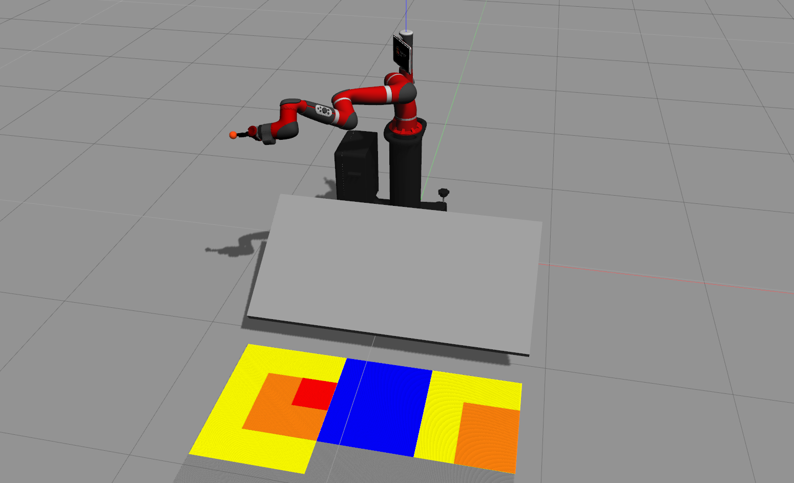

# Gazebo Simulation of "Motion learning using Bayesian optimization in an environment with an unkown object

## Installation of `saywer_robot`
For `melodic`, copy and paste as it is, others change `melodic` to your specific version. 
```
sudo apt-get install git-core python-argparse python-wstool python-vcstools python-rosdep ros-melodic-control-msgs ros-melodic-joystick-drivers ros-melodic-xacro ros-melodic-tf2-ros ros-melodic-rviz ros-melodic-cv-bridge ros-melodic-actionlib ros-melodic-actionlib-msgs ros-melodic-dynamic-reconfigure ros-melodic-trajectory-msgs ros-melodic-rospy-message-converter
```

## Installation of `saywer_simulator`
For `melodic`, copy and paste as it is, others change `melodic` to your specific version. 
```
sudo apt install ros-melodic-qt-build ros-melodic-gazebo-ros-control ros-melodic-gazebo-ros-pkgs ros-melodic-ros-control ros-melodic-control-toolbox ros-melodic-realtime-tools ros-melodic-ros-controllers ros-melodic-xacro python-wstool ros-melodic-tf-conversions ros-melodic-kdl-parser ros-melodic-sns-ik-lib ros-melodic-effort-controllers
```


## Image


## To run
```
roslaunch sawyer_bopt bopt_experiment.launch
```

### options
#### Change world 
```
roslaunch sawyer_bopt bopt_experiment.launch world_name:=bopt_exp_60
```

world_name has options
- bopt_exp_30
- bopt_exp_60

#### Change experiment
```
roslaunch sawyer_bopt bopt_experiment.launch experiment:=convergence
```

experiment has options
- comparison 
- convergence
